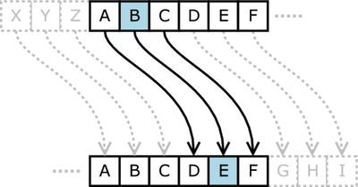

# CS 1440 Sample Project: Caesar Cipher Instructions

## Description

> "The Caesar cipher is one of the earliest known and simplest ciphers. It is a
> type of substitution cipher in which each letter in the plaintext is
> 'shifted' a certain number of places down the alphabet. For example, with a
> shift of 1, A would be replaced by B, B would become C, and so on. The method
> is named after Julius Caesar, who apparently used it to communicate with his
> generals."
> 
> [Practical Cryptography](http://practicalcryptography.com/ciphers/caesar-cipher/%C2%A0)

The Wikipedia article on the [Caesar cipher](https://en.wikipedia.org/wiki/Caesar_cipher/) offers more information about this simple cipher.

I introduce two pieces of Cryptography jargon to facilitate our discussion of your assignment:

-   **Plaintext**: The original, human-readable message
-   **Ciphertext**: The result of applying a cipher to a plaintext message

Observe the effect of the Caesar cipher of various rotation offsets upon the alphabet:

Rotation of 1 position (rot1)

	plaintext:  ABCDEFGHIJKLMNOPQRSTUVWXYZ
	ciphertext: BCDEFGHIJKLMNOPQRSTUVWXYZA

Rotation of 5 positions (rot5)

	plaintext:  ABCDEFGHIJKLMNOPQRSTUVWXYZ
	ciphertext: FGHIJKLMNOPQRSTUVWXYZABCDE

Rotating the rot5 ciphertext above by 21 positions decrypts it

	ciphertext: FGHIJKLMNOPQRSTUVWXYZABCDE
	plaintext:  ABCDEFGHIJKLMNOPQRSTUVWXYZ

## Requirements

*   Write a program which applies the Caesar Cipher to a text file of the user's choice.
*   Take command line arguments to specify a file and rotation distance
    *   The first command line argument is a string representing the file name
        *   This argument is **required**
        *   Ensure the file exists and is readable
        *   If the file does not exist/is not readable, **let Python's `open` function crash**
    *   The second command line argument is an integer representing the rotation distance
        *   This argument is **optional**
        *   The valid cipher rotation distance must be an integer in the range `[0, 25]`
        *   If this argument is not given, output all valid rotation distances `[0, 25]`
    *   If NO command line arguments are specified, produce a usage message
        *   Produce this same usage message if arguments are invalid, with an extra message at the beginning, indicating there was an invalid argument
*   Before displaying the deciphered text, first print a banner to indicate the rotation distance used.
    *   When running through all possible rotations this banner is repeated 26 times.
    *   The user can scroll through the output to find the plaintext; the banner will inform the user which one of the possible rotations was the correct key.
*   Rotate the text in the file by iterating over the file one character at a time.
    *   When a letter is encountered turn it into an integer, add the rotation distance, convert it back into a letter, and print it.
    *   There is a trick to handling letters that would be rotated past the end of the alphabet.
    *   I'll leave it to you to figure this out yourself.
*   The program displays non-alphabetic characters without changing them.
    *   The Caesar Cipher *only* affects letters!
    *   Digits, white space, newlines, punctuation, and any other characters are **not** encrypted by the Caesar Cipher. They are left untouched.
        *   This means that the formatting of the original message should be preserved.
